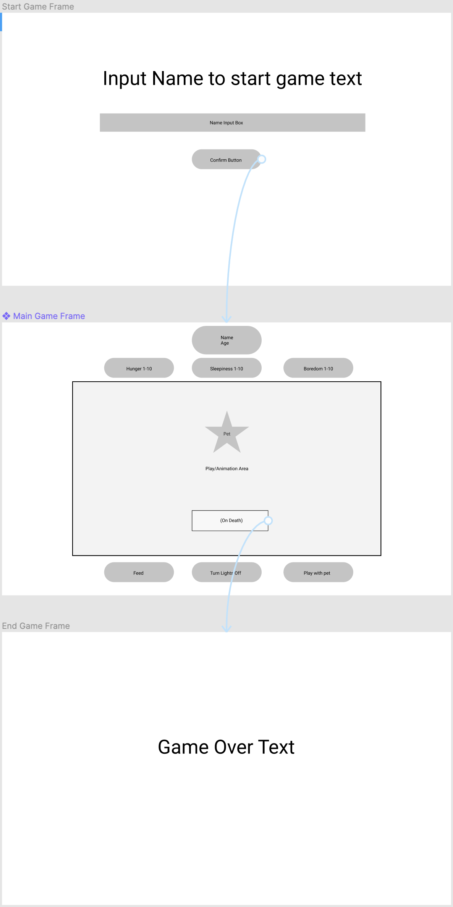

# project-tamagotchi
## Project inspired by the 90s fad digital pet tamagotchi

## User Story
Peter Parfer is a college student that enjoys video games and spending time with his tarantula. 

Peter Parfer has always been interested in something that he could enjoy for both

Peter Parfer said:
* I've always wanted a game that could simulate spending time with my pet while I am away. I want to have fun, but also work on improving habits for checking on my pet. 

* I want a digital pet that I can name and is shown on screen and would run around and do the typical eat/sleep/play. 

* There should be buttons that correspond to feeding, putting to bed, or playing with the pet. This will help keep the metered stats low by 1 point 

* These stats should have a 1-10 point meter. And there should be an indicator of how they are feeling. If they ever get too high at the max of 10 then the pet should die and your game is over.

* An age should also be shown and it should grow in age over time. An age such as 1 year for every 10 minutes.

## [Wireframe](https://www.figma.com/proto/xqAUigx0venGkUbjyyQKOc/Project-Tamagotchi?node-id=23%3A75&scaling=min-zoom)

The concept of this [wireframe](https://www.figma.com/proto/xqAUigx0venGkUbjyyQKOc/Project-Tamagotchi?node-id=23%3A75&scaling=min-zoom) is to make the game as clear as possible to the user. When starting the game there is only one option of entering the name. 

After entering the name the main game screen will show show  all hunger / sleepiness / boredom stats on display at all times for the user to accurately play the game. All the corresponding eat / sleep / play buttons are also available to interact with the pet and play the game.

Lastly when any of the key stats reach 0 the pet will die and the user will be shown the end game screen.

From start to finish the user should have no issue of getting lost in the game.

<html>
<iframe style="border: 1px solid rgba(0, 0, 0, 0.1);" width="728" height="450" src="https://www.figma.com/embed?embed_host=share&url=https%3A%2F%2Fwww.figma.com%2Fproto%2FxqAUigx0venGkUbjyyQKOc%2FProject-Tamagotchi%3Fnode-id%3D23%253A75%26scaling%3Dmin-zoom" fullscreen></iframe>
</html>