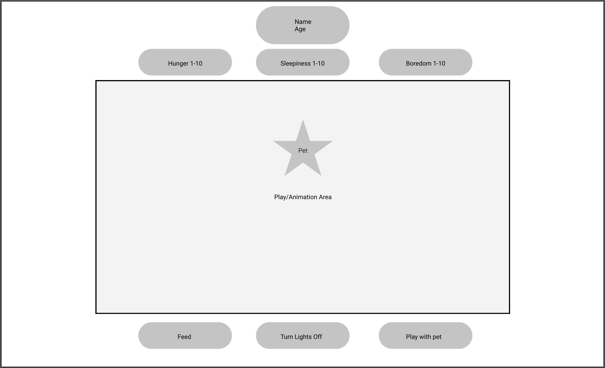

# project-tamagotchi
## Project inspired by the 90s fad digital pet tamagotchi

## User Story
Peter Parfer is a college student that enjoys video games and spending time with his tarantula. 

Peter Parfer has always been interested in something that he could enjoy for both

Peter Parfer said:
> I've always wanted a game that could simulate spending time with my pet while I am away. I want to have fun, but also work on improving habits for checking on my pet. I want a digital pet that would run around and do the typical eat/sleep/play. There should be buttons that correspond to feeding, putting to bed, or playing with the pet. There should also be an indicator of how they are feeling. 

## Wireframe
